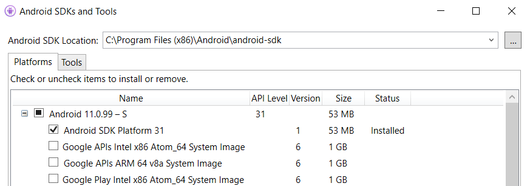
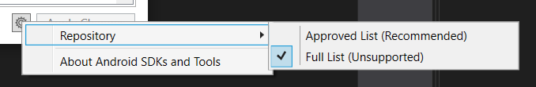

## .NET 6 SDK

1. Uninstall any .NET 6 versions and workload previews using this script:  
   https://github.com/Redth/dotnet-maui-check/blob/main/Clean-Old-DotNet6-Previews.ps1  
   > This is just in case maui-check installed an conflicting version some time ago. You won't be able to uninstall version installed by VS, but this is fine to ignore. It is more to remove the versions before preview 7.
1. Install .NET 6 RC 2  
   Win: https://dotnetcli.azureedge.net/dotnet/Sdk/6.0.100-rc.2.21474.31/dotnet-sdk-6.0.100-rc.2.21474.31-win-x64.exe   
   macOS: https://dotnetcli.azureedge.net/dotnet/Sdk/6.0.100-rc.2.21474.31/dotnet-sdk-6.0.100-rc.2.21474.31-osx-x64.pkg  

## .NET MAUI Workload

Install the .NET Maui Workload using 2 commands:

1. Set all the versions you need to the version you are looking for:  
   For example, the "preview.9" branch:
   ```
   dotnet workload update --from-rollback-file https://aka.ms/dotnet/preview.9/main.json --source https://aka.ms/dotnet6/nuget/index.json
   ```
   Or, the "main" branch:
   ```
   dotnet workload update --from-rollback-file https://aka.ms/dotnet/maui/main.json --source https://aka.ms/dotnet6/nuget/index.json
   ```  
1. Install the maui workload using those exact versions
   ```
   dotnet workload install maui --skip-manifest-update --source https://aka.ms/dotnet6/nuget/index.json
   ```

> You'll probably need to run these commands with elevated privileges.

Here is a quick copy-paste for installing maui "preview.9":

```
dotnet workload update --from-rollback-file https://aka.ms/dotnet/maui/preview.9.json --source https://aka.ms/dotnet6/nuget/index.json
dotnet workload install maui --skip-manifest-update --source https://aka.ms/dotnet6/nuget/index.json
```
And for "main":

```
dotnet workload update --from-rollback-file https://aka.ms/dotnet/maui/main.json --source https://aka.ms/dotnet6/nuget/index.json
dotnet workload install maui --skip-manifest-update --source https://aka.ms/dotnet6/nuget/index.json
```

If you are building maui yourself, this might help too:

```
dotnet workload update --from-rollback-file https://aka.ms/dotnet/maui/main.json --source https://aka.ms/dotnet6/nuget/index.json
dotnet workload install android ios maccatalyst tvos macos maui wasm-tools --skip-manifest-update --source https://aka.ms/dotnet6/nuget/index.json
```

## Prerequisites

### Windows

Make sure to **remove all previous** Reunion extensions and install the new one:

https://marketplace.visualstudio.com/items?itemName=ProjectReunion.MicrosoftSingleProjectMSIXPackagingToolsDev17

### iOS

iOS will require Xcode 13 beta 5. You can get this [here](https://developer.apple.com/download/more/?name=Xcode).

### Android

Android API-31 (Android 12) is now the default in .NET 6 rc1.

To install go to `Tools` > `Android` > `Android SDK Manager`:



You may need to enable all sources as well:



## Building Apps

Create new projects via `dotnet new maui` or the .NET MAUI template in Visual Studio 2022.

Until .NET 6 releases day, you will need a `nuget.config` file such as:

```xml
<?xml version="1.0" encoding="utf-8"?>
<configuration>
  <packageSources>
    <add key="dotnet6" value="https://pkgs.dev.azure.com/dnceng/public/_packaging/dotnet6/nuget/v3/index.json" />
  </packageSources>
</configuration>
```
